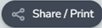

# Getting started 

## Open the RaPP Map Web Page   

(__YouTube Video link__: [1. How To Open RaPP Map - YouTube](https://www.youtube.com/watch?v=igcBH6vaF5U&list=PLFdCbzW2JOUo13LNGrlO4Ww2k0uzjvvje&index=8)) 

Launch the RaPP map tool using the URL [https://map.geo-rapp.org/](https://map.geo-rapp.org/). It is best to use a recent browser with WebGL support such as the latest version of Google Chrome (recommended) or Edge. Older browsers may have less functionality.  

- For best performance use a recent browser  
- Click _Continue_ to close the landing page  

<figure>

<figcaption align="center">
</figcaption>Figure 1: Landing page 
</figure>

RaPP Map works best on a laptop, desktop, or tablet. It can be used on some mobile phones however the smaller screen may change the appearance of the interface and remove some functionality.  

Help videos are available in the channel [https://www.youtube.com/channel/UC7s3CQngiHpmkHHBlNfzmTw](https://www.youtube.com/channel/UC7s3CQngiHpmkHHBlNfzmTw).

## Layout of RaPP Map  

RaPP map has two main parts: the map viewer (Right hand side), and the workbench (navigation pane - Left hand side):  

1. Map viewer: view the data in the display on the right. There are tools to navigate around the map, change the background map, and share what you see.  
1. Workbench (navigation pane): the data and analysis menu on the left lets you search for locations, choose layers to view, and analyse and find reports.  

<figure>

<figcaption align="center">
</figcaption>Figure 2: Layout of the Rapp Map
</figure> 

### Map Viewer 

The map viewer displays the spatial data or maps that you have selected. To improve your experience, you can use the buttons to the top and right of the map viewer.   

Table 1 List of buttons

| Icon | Short name | Description |
| :-----: | ---------- | ----------- |
|  | About | Information and background on the RaPP Map project and help guide. This will open in a separate tab in your browser |
|  | Related Maps | Find other map products built using the Terria platform. These will open in a separate window or tab |
|  | Map Settings | Set the Map View, Terrain, Basemap, Timeline, Image Optimization and Raster Map Quality. See section [Map Settings](map-view-display-options.md#map-settings) |
|  | Help | Find useful tips on how to use RAPP map including a quick tour, the RaPP map user guide at Getting Started, and a generic TerriaJS platforms user guide  |
|  | Story | Create and share interactive annotated map scenes. See section [Story](share-print-story.md#story) |
|  | Share / Print | Generate a link to what you see on the screen which can be shared with others and open a printable version of the map |
|  | Gyroscope Controls (Only in 3D mode) | Tilt and rotate the map. See section [Gyroscope](map-view-display-options.md#gyroscope) |
|  | + , – and Home buttons | Zoom in, zoom out and go home to the default view showing Australia |
|  | Location | Centres the map to your current location if you have location services turned on your device |
|  | Compare | Turn split screen mode on and off. See section [Compare](map-view-display-options.md#compare) |
|  | Pedestrian Mode | Helps "touring" a 3D landscape, navigating at the terrain level |
|  | Line measure | Measuring tool to measure distance between points in kilometres |
|  | Give Feedback | You can send feedback directly from the maps, by clicking on the Feedback button |

More information on the map viewer display options is at section [Map viewer display options](map-view-display-options.md).  

### Workbench (navigation pane) 

The workbench or navigation pane is on the left. From the workbench you can search for locations, choose layers to view, and analyse and find reports. Click _Explore_ map data to access more functions from a pop-up window.
