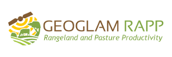
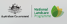

# GEOGLAM RaPP Map

Version: DRAFT USER GUIDE August 2022

Geoglam RaPP Map is an online tool providing timeseries data on vegetation and environmental conditions.

RAPP Map is the spatial data platform for the National Landcare Regional Partnerships Program.
This online tool provides time-series data on vegetation and environmental conditions, allowing national and regional reporting of vegetation cover change. It has been developed and is currently hosted by Data61. RAPP Map is supported by

- [CSIRO](https://www.csiro.au/)
- [Department of Agriculture, Fisheries and Forestry](https://www.agriculture.gov.au/)
- [Australian Bureau of Agricultural and Resource Economics and Sciences (ABARES)](https://www.agriculture.gov.au/abares)
- Through funding from the [Department of Climate Change, Energy, the Environment and Water](https://www.dcceew.gov.au/)
- and Regional land partnership flagship project under [Australian Government’s National Landcare Program](https://www.dcceew.gov.au/environment/land/landcare).

  
